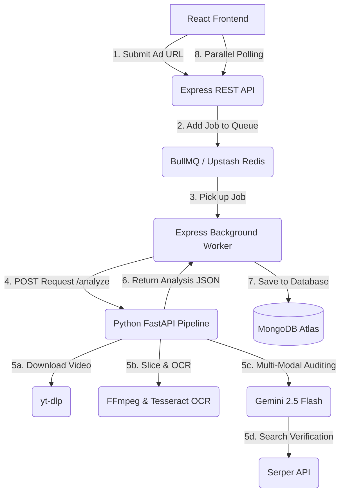

# 🔍 ClaimLens - Multi-Modal AI Credibility Analysis Platform

ClaimLens is a premium, full-stack enterprise web application designed to automatically analyze and audit the credibility of advertisements across major social media networks (YouTube, Instagram). 

By simply pasting an ad URL, our background orchestration system runs a robust, multi-modal Python pipeline that extracts audio transcriptions, processes visual frames, parses on-screen text via OCR, and cross-references assertions with Google Search to identify deceptive claims, visual manipulations, and misleading comparative statements. It leverages **Gemini 2.5 Flash** for deep multimodal analysis and the **Serper Google Search API** for live fact-checking, ultimately generating a comprehensive credibility report and verdict.

---

## 🏗️ Architecture & Job Flow



The system uses a highly resilient **asynchronous queue architecture** to ensure long-running video audits never freeze the web server or block other users. 

---

## ✨ Features

* **Multi-Modal Analysis**: Correlates audio transcript, visual text overlays (OCR), and raw frame sequences.
* **Background Queue Processing**: Uses **BullMQ** and **Upstash Redis** to insulate server CPU during heavy AI workloads.
* **Live Fact-Checking**: Automatically searches the web using the **Serper Google Search Engine** to verify claims.
* **Self-Healing Middleware**: Automatically heals database records created before the queue integration, promoting legacy records to `'completed'` on-the-fly and eliminating infinite polling loaders.
* **Beautiful Dashboard & Reports**: Premium dark-mode user interface utilizing **TailwindCSS**, dynamic loading indicators, and rich visual report charts powered by **Recharts**.

---

## 📁 Repository Structure

```text
ClaimLens/
├── Backend/                 # Node.js Express REST API & Worker
│   ├── config/              # Database & Cloud service initializers
│   ├── Controllers/         # Endpoint route controllers
│   ├── Models/              # Mongoose/MongoDB Schemas
│   ├── queues/              # BullMQ queue triggers
│   ├── workers/             # Async background worker tasks
│   └── .env.sample          # Configuration template for Backend
├── Services/                # FastAPI AI Orchestration Pipeline
│   ├── app/                 # Python source files (analyser, downloader, ocr)
│   ├── Dockerfile           # Multi-package container specification
│   └── .env.sample          # Configuration template for Services
├── Frontend/                # Vite React.js SPA Dashboard
│   ├── src/                 # Components, Pages, and Styling
│   └── .env.sample          # Configuration template for Frontend
├── docker-compose.yml       # Production-grade system orchestrator
└── README.md                # Comprehensive documentation (This file)
```

---

## ⚙️ Setup & Local Installation

### Prerequisites
Make sure you have the following installed on your system:
* **Node.js** (v18 or higher)
* **Python** (v3.12)
* **Docker & Docker Desktop** (Recommended)
* **FFmpeg** and **Tesseract OCR** (If running locally without Docker)

---

### Option A: Complete Setup via Docker Compose (Recommended) 🐳

This is the fastest, cleanest way to spin up the entire backend ecosystem. It builds and launches both the Express server, background workers, and FastAPI server in unison inside isolated containers.

#### 1. Set Up Environment Files
Create a `.env` file in the **`Backend/`** and **`Services/`** directories using the provided templates:
```bash
cp Backend/.env.sample Backend/.env
cp Services/.env.sample Services/.env
```
Open each `.env` file and insert your API keys (MongoDB Atlas, Upstash Redis, Gemini API, Serper API).

#### 2. Terminate Host Port Conflicts
Before launching Docker Compose, ensure your host ports `5000` and `8000` are completely free:
* **Windows (PowerShell)**:
  ```powershell
  Get-Process -Id (Get-NetTCPConnection -LocalPort 5000 -ErrorAction SilentlyContinue).OwningProcess -ErrorAction SilentlyContinue | Stop-Process -Force
  ```

#### 3. Build & Run Containers
Run the following orchestrator command inside the project root:
```bash
docker compose up --build -d
```
* **AI FastAPI service** will listen on: `http://localhost:8000`
* **Express REST API & worker** will listen on: `http://localhost:5000`

#### 4. Spin Up the React Frontend
Open a new terminal tab, navigate to the `Frontend` directory, install packages, and boot up the development server:
```bash
cd Frontend
npm install
npm run dev
```
* **Frontend Web Dashboard** will open at: `http://localhost:5173`

---

### Option B: Standalone Local Setup (Without Docker) 💻

If you prefer to run services manually on your local system:

#### 1. Start the Python AI Service
1. Navigate to the `Services` directory:
   ```bash
   cd Services
   python -m venv .venv
   .venv\Scripts\activate   # On Mac/Linux: source .venv/bin/activate
   pip install -r requirements.txt
   ```
2. Make sure system binaries for `ffmpeg` and `tesseract` are added to your System PATH variables.
3. Start the FastAPI server:
   ```bash
   uvicorn app.main:app --port 8000 --reload
   ```

#### 2. Start the Express Backend & BullMQ Worker
1. Navigate to the `Backend` directory:
   ```bash
   cd Backend
   npm install
   ```
2. Spin up a local Redis instance or map `REDIS_URL` in `.env` to a hosted Upstash cluster.
3. Start the development server (runs backend API and worker together):
   ```bash
   npm run dev
   ```

#### 3. Start the React Frontend
1. Navigate to the `Frontend` directory:
   ```bash
   cd Frontend
   npm install
   npm run dev
   ```

---

